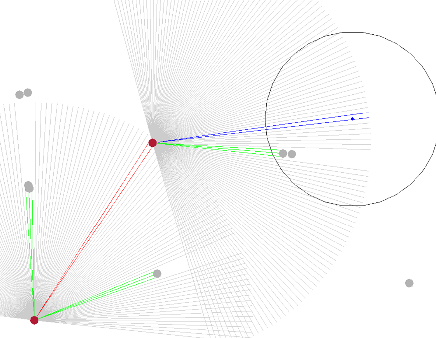

# OpenAI Gym herding environment

The Herding env is a reinforcement learning environment compliant with the OpenAI Gym interface.
It consists of two kinds of agents, dogs and sheep herd. The environment takes as input the commands
to control the dogs. Their task is to gather the scattered sheep herd into a specified area.



Installation
============
### 1. Install pyopencl
https://wiki.tiker.net/PyOpenCL/Installation
### 2. Install herding package

For developement purposes it's better to install it in place (-e option).

```
pip install -e <package_directory>
```
Running
============

## 1. Create environment
You can directly create environment and specify the parameters.
```python
import herding

env = herding.Herding(
    dog_count=3,
    sheep_count=20
)
```
## 3. Manual steering
You can play the scenario yourself.
```
python utils/manual_steering.py
```
